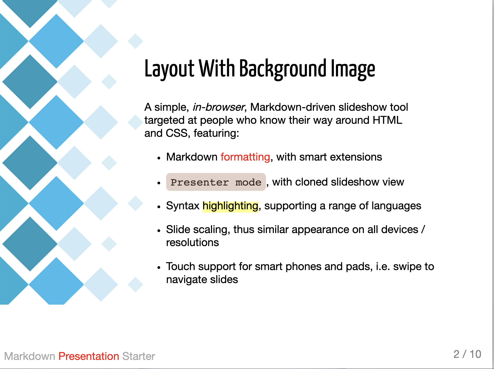
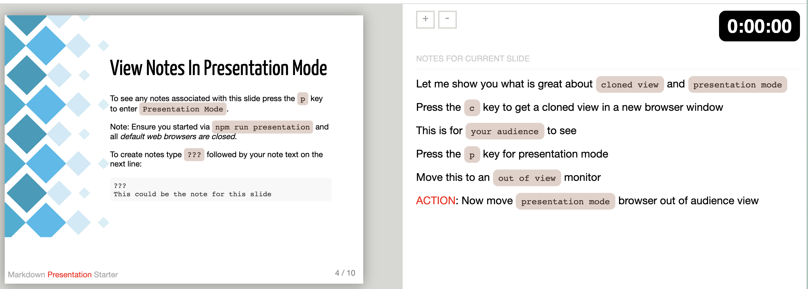

# Markdown Presentation Starter
This is an `in-browser` presentation starter based on markdown files and the **[RemarkJs.com](https://www.remarkjs.com)** library.

There is also a walkthrough video here:
**[https://www.youtube.com/watch?v=jFePkTwgOTM](https://www.youtube.com/watch?v=jFePkTwgOTM)**

## Prerequisites
- **[Node.js](https://nodejs.org/en/download/)**  
- A file editor similar to **[Visual Studio Code](https://code.visualstudio.com/download)**
- Optional - Install **[Git](https://git-scm.com/downloads)**    

## Quickstart Via Git
```bash
git clone https://github.com/dantullis/markdown-presentation-starter.git
cd markdown-presentation-starter
git remote remove origin
npm install
npm run presentation
```

## Quickstart Via Download
```bash
web browse to https://github.com/dantullis/markdown-presentation-starter
press on the green `Code` button 
press on `Download ZIP`
extract the ZIP file
cd markdown-presentation-starter-main
npm install
npm run presentation
```

## Example Layout


## Example In Presentation Mode


## Instantiate Presentation Mode 
In order to instantiate `Presentation Mode` in the default web browser, **[Dead-Server](https://github.com/belauzas/dead-server)** needs to start with all instances of the default web browser(s) already closed.

**NOTE**: If use of the keyboard shortcuts don't work, then close all web browsers and start `Markdown Presentation Starter` again.

## Use Of Dead-Server (a Live-Server replacement)
**[Dead-Server](https://github.com/belauzas/dead-server)** is an updated fork of the non-maintained **[Live-Server](https://github.com/tapio/live-server)**

 Dead-Server is used for these reasons:
* Live reload / hot reload - As you edit any file (presentation.md, styles.css, ...) the server will reload the file and you’ll see your changes right away.
* Separate Markdown File - To be able to use a separate markdown file (presentation.md) it is necessary to use a web server. See `Use Of Separate Markdown File` below.

**NOTE**: It works great as a `local-only-use` web server. **DO NOT** use Dead-Server for a production web site. This is just for local use only. 
## Use Of Separate Markdown File
This starter project keeps the Markdown source in a separate file (presentation.md) using the sourceUrl field:
```JavaScript
var slideshow = remark.create({
  sourceUrl: 'presentation.md'
});
```

When working locally, with your presentation HTML opened directly from disk, using the `sourceUrl` won't work out of the box. This requires hosting your files using a web server, thus the implementation of this `Markdown Presentation Starter` project.

## Use Of DeckTape 
**[DeckTape](https://github.com/astefanutti/decktape)** is a high-quality PDF exporter for HTML presentation frameworks. DeckTape natively supports **[RemarkJs.com](https://www.remarkjs.com)**. To export you need to be serving your presentation, and then run the export command.

Usage:
* npm run presentation
* open a new terminal
* npm run export 

## Fonts
The fonts included (Ubuntu Mono, Yanone Kaffeesatz and Droid Serif) are all from Google Fonts, which are free to use, as stated **[here](https://fonts.google.com/about)**

>All the fonts and icons in our catalog are free and open source, making beautiful typography and iconography accessible to anyone for **any** project.

## Documentation
There is a **lot** of documentation on the **[RemarkJs.com](https://github.com/gnab/remark/wiki)** wiki

## Sample Documentaion
* **[Background image](https://github.com/gnab/remark/wiki/Markdown#background-image)**
* **[Keyboard Shortcuts](https://github.com/gnab/remark/wiki/Keyboard-shortcuts)**
* **[Formatting](https://github.com/gnab/remark/wiki/Formatting)**
* much more ...

## License
MIT License

