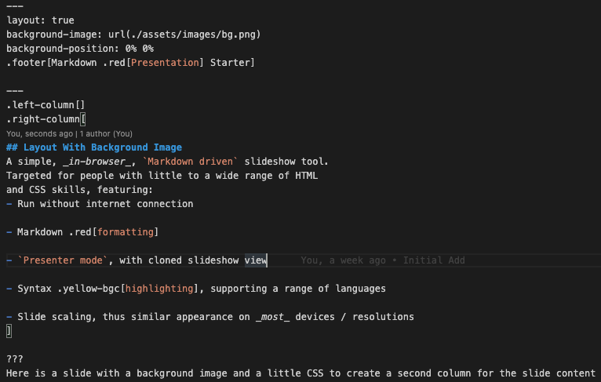

class: center, middle, inverse, title-slide

# Markdown Presentation Starter
### Dan Tullis

**[https://github.com/dantullis/markdown-presentation-starter](https://github.com/dantullis/markdown-presentation-starter)**

???
Welcome

This is a quick walkthrough of the `Markdown Presentation Starter`

I'm gonna go over the download, the install, and how to run it locally

I'll also go over the example project and give a few pointers

Ok, let's dive right into it

.red[ACTION]: SWITCH to smaller VIDEO scene

.red[ACTION]: SWITCH to README.md on GitHub

.red[ACTION]: SWITCH to terminal in a temp directory

Let's follow the directions listed in the README

---
layout: true
background-image: url(./assets/images/bg.png)
background-position: 0% 0%
.footer[Markdown .red[Presentation] Starter]

---
.left-column[]
.right-column[
## Layout With Background Image
A simple, _in-browser_, `Markdown driven` slideshow tool.  
Targeted for people with little to a wide range of HTML  
and CSS skills, featuring:
- Run without internet connection

- Markdown .red[formatting]

- `Presenter mode`, with cloned slideshow view

- Syntax .yellow-bgc[highlighting], supporting a range of languages

- Slide scaling, thus similar appearance on _most_ devices / resolutions
]

???
Here is a slide with a background image and a little CSS to create a second column for the slide content

Like the slide sates:
- this project can be run `without an internet connection` 
- use a wide variety of `formatting`
- and has `presentation mode`

---
layout: false
# Layout Example

.center[]

.footer[Markdown .red[Presentation] Starter]

???
Here is the Markdown and CSS used for the previous slide

---
layout: false
class: inverse

# Keyboard Shortcuts
.large[
- `?` or `h`: Toggle the help window

- `→` : Go to next slide

- `←` : Go to previous slide

- `c`: Clone presentation to a new window

- `p`: Toggle presenter mode

- `f`: Togggle full screen mode

- `t`: Start/stop timer

- `number + return`: Go to page `number`
]
.footer[Markdown .red[Presentation] Starter]

???
You can access `help` or any of the keyboard `shortcuts` by pressing the `h` key 

---
layout: true
background-image: url(./assets/images/bg.png)
background-position: 0% 0%
.footer[Markdown .red[Presentation] Starter]

---
.left-column[]
.right-column[
# View Notes In Presentation Mode
I'm actually using the notes for this presentation `right now`

To see any notes associated with this slide press the `p` key to enter `Presentation Mode`.  

Note: Ensure you started via `npm run presentation` and all _default web browsers are closed_.  

To create notes type `???` followed by your note text on the next line:
```markdown
???
This could be the note for this slide
```
]

???
Let me show you what is really great about about this project:

- `cloned view` and `presentation mode`

Press the `c` key to get a cloned view in a new browser window

This is for `your audience` to see

Press the `p` key for presentation mode

Move this to an `out of view` monitor

.red[ACTION]: Also, notice how you can increase or decrease the size of the note by pressing the plus or minus keys

.red[ACTION]: Now move `presentation mode` browser out of audience view

---
layout: false

# Two dashes

The easiest way to build incremental slides is...  

--

to use two dashes `--` to separate content on a slide.

--

You can divide a slide in _any way you want_.

--

- One bullet

--

- Another bullet

--

- And one more
.footer[Markdown .red[Presentation] Starter]

???
.yellow-bgc[Incremental slides can be a litle confusing and maybe should be called something else.]

You still need to put your note at the end of the slide, not at the end of each increment

---
layout: true
background-image: url(./assets/images/bg.png)
background-position: 0% 0%
.footer[Markdown .red[Presentation] Starter]

---
.left-column[]
.right-column[
# Code Blocks

Java code block:
```java
static void myMethod() {
  System.out.println("hello");
}
```

JavaScript code block:
```javascript
function add(a, b)
  return a + b
end
```
]

???
Here are two examples of using a code block

---
.left-column[]
.right-column[
# Code Blocks Markdown


]

???
Here is the syntax used for the code blocks in the previous slide

---
.left-column[]
.right-column[
# Highlight In Code Blocks

Highlight by using a leading `*`:

```markdown
*Highlighted
```

```c
if (a == b) {
** a + b
}
```

Output:
```c
if (a == b) {
* a + b
}
```
]

???
Here is an examples of hightlights in a code block

Highlight by using a leading asterisk `inside the code block`

---
.left-column[]
.right-column[
# Highlight Markdown


]

???
Here is the syntax used for the code blocks in the previous slide

---
.left-column[]
.right-column[
[//]: # ( this is a hidden comment )  
# Hidden Comments  

To create a hidden comment:
```sh
[//]: # ( the comment )
```
]

???
Here is an example of a hidden comment

---
.left-column[]
.right-column[
## MathJax
To create the `equation` below:  
`\(\color{blue} {\frac{a}{\color{red} b} \sqrt{\color{black} x}}\)`

Enter the following:
```latex
`\(\color{blue} {\frac{a}{\color{red} b} \sqrt{\color{black} x}}\)`
```
]

???
You can `right-click` on the `MathJax` object for further functionality

.red[ACTION]:
- Right-click
- Show Math As
- Tex Commands
---
layout: false
class: center, middle, inverse

**[Markdown Presentation Starter](https://github.com/dantullis/markdown-presentation-starter)**  
Created with:  
**[RemarkJs.com](https://www.remarkjs.com)**  
**[Live-Server](https://github.com/tapio/live-server)**  
**[MathJax.org](https://www.mathjax.org/)**  
**[DeckTape](https://github.com/astefanutti/decktape)**

--
##### Any Suggestions / Issues?
https://github.com/dantullis/markdown-presentation-starter/issues

???
Hope this walkthrough was helpful. If you have any questions or issues visit the GitHub URL listed here and let me know.